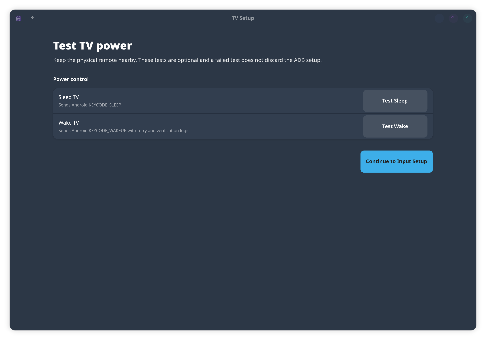
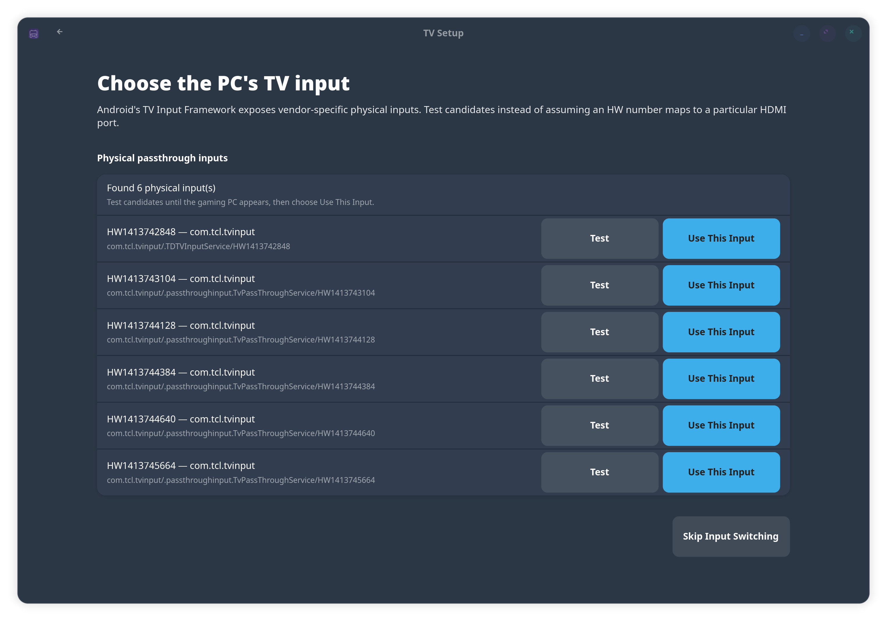

# HTPC Control Center

A native GTK4/libadwaita application for making a Linux gaming HTPC behave more like a console.

The initial release combines the proven pieces of two earlier proof-of-concept projects into one application with a graphical setup flow:

- **TV Control** inherits the complete Android TV / Google TV side of `ATV-Couch-Wake`: ADB authorization, wake, sleep, direct physical-input selection, startup/resume automation, and suspend/shutdown/reboot behavior.
- **Controller Wake** inherits the topology-based implementation from `HTPC-Controller-Wake`: multiple USB receiver selection, discovery of the actual wake-capable USB ancestry, selective persistent udev rules, and the pre-suspend quiet-window guard.
- The old controller implementation from `ATV-Couch-Wake` is **not** used.

> **Alpha software:** test TV wake/sleep, input switching, suspend, and controller wake on your own hardware before relying on them.

<p align="center">
  
</p>

<p align="center"><em>The first-run dashboard keeps TV setup and controller wake separate while surfacing the prerequisites both features share.</em></p>

## v1 scope

### TV operating systems

- **Android TV / Google TV:** supported.
- **Other TV operating systems:** contributors needed.

The TV backend is intentionally provider-oriented so future LG webOS, Samsung Tizen, Roku, Fire TV, or other implementations can be added without changing controller wake. The project does not label untested platforms as “coming soon” because the maintainer cannot validate hardware he does not own.

### Controller wake

Controller wake is for a controller whose wake signal reaches the PC through a **USB receiver/dongle**, typically 2.4 GHz. It configures wake from system suspend; it does not promise power-on from a full shutdown and does not configure Bluetooth-only controller wake.

## Design goals

- Graphical choices for normal setup; no terminal-driven wizard.
- Short prerequisite tips before a step needs them, with the README available for details.
- The GTK application always runs as the logged-in user.
- TV lifecycle automation is a per-user systemd service.
- Controller changes use the normal desktop Polkit prompt through `pkexec` only when administrator access is actually required.
- No automatic package-manager changes or immutable-image layering.
- TV and controller features remain independent.

## Requirements

### Base application

- Linux with systemd.
- Python 3.10 or newer.
- GTK4, libadwaita **1.4 or newer**, and PyGObject from the distribution.
- Polkit/`pkexec` for controller-wake changes.

Bazzite is the primary tested target, but the application code is not Bazzite-specific.

Typical GUI package names:

```text
Fedora / Bazzite: python3-gobject gtk4 libadwaita
Arch / CachyOS:   python-gobject gtk4 libadwaita
Debian / Ubuntu:  python3-gi gir1.2-gtk-4.0 gir1.2-adw-1
```

### Android TV / Google TV

Install Android platform tools before TV setup:

```bash
# Bazzite (recommended)
brew install android-platform-tools

# Fedora
sudo dnf install android-tools

# Arch Linux / CachyOS
sudo pacman -S android-tools

# Debian / Ubuntu
sudo apt install adb

# openSUSE
sudo zypper install android-tools
```

On Bazzite, HTPC Control Center checks Linuxbrew directly in addition to the normal graphical-session `PATH`. This matters because an app launched from the desktop may not inherit `/home/linuxbrew/.linuxbrew/bin` even when `brew install android-platform-tools` has already installed ADB. When Homebrew ADB is found, the app saves its absolute path so the lifecycle watcher does not depend on shell PATH setup later.

### Controller wake

`lsusb` is required for USB receiver selection and normally comes from the `usbutils` package.

Your firmware must also permit the relevant USB/host-controller wake path. Settings are commonly named USB Wake Support, Wake from USB, PME/PCIe Wake, ErP, or Deep Sleep, but names and behavior vary by motherboard.

## Install

### One-line installer

Once at least one stable GitHub Release has been published, the recommended install command is:

```bash
curl -fsSL https://raw.githubusercontent.com/andy10115/HTPC-Control-Center/main/bootstrap.sh | bash
```

`bootstrap.sh` is intentionally tiny. It asks GitHub for the latest **stable** release, downloads that release's source archive to a temporary directory, and runs the release's normal `install.sh`. It never installs development code directly from `main`.

The bootstrap installer follows GitHub's repository-tarball API using the GitHub JSON media type, then follows GitHub's redirect to the generated source archive. Drafts and prereleases are intentionally ignored.

### From a clone

```bash
git clone https://github.com/andy10115/HTPC-Control-Center.git
cd HTPC-Control-Center
./install.sh
```

The installer:

1. Checks Python 3.10+ and the native GTK4/libadwaita Python bindings.
2. Creates an isolated virtual environment under `~/.local/share/htpc-control-center/venv` with access to the distribution's GI bindings.
3. Installs the application and Python-only dependencies into that environment.
4. Installs `htpc-control-center` under `~/.local/bin`.
5. Installs a normal desktop entry and the purple HTPC Control Center application icon.
6. Does **not** install ADB, usbutils, system packages, udev rules, or privileged services automatically.

Launch **HTPC Control Center** from the application menu or run:

```bash
htpc-control-center
```

On first launch, both feature cards show **Not configured**. Start either flow independently; configuring one does not require configuring the other.

## Uninstall

Every normal install also installs an uninstaller, so you do **not** need to keep the repository checkout. Remove HTPC Control Center with:

```bash
htpc-control-center-uninstall
```

The uninstaller:

1. Stops and removes the per-user TV lifecycle watcher.
2. Removes the application, desktop entry, application icon, and local virtual environment.
3. Requests administrator authorization through Polkit to remove HTPC Control Center's udev rule, controller wake targets, privileged helper, and 5-second suspend guard when those components were configured.
4. Removes the saved HTPC Control Center configuration and update state.

To remove the application and automation while keeping the saved TV configuration for a later reinstall:

```bash
htpc-control-center-uninstall --keep-config
```

If you are working directly from a repository checkout, `./uninstall.sh` and `./uninstall.sh --keep-config` perform the same actions.

## Application updates

HTPC Control Center uses **GitHub Releases**, not the development `main` branch, as its application update channel.

- Automatic update checks are enabled by default.
- A background check is attempted at most once every 24 hours.
- If GitHub is temporarily unreachable, application startup continues normally without an error dialog.
- When a newer stable release is known, the home screen shows an **Update** banner.
- **Preferences → Updates** contains the current version, an **Automatically check for updates** switch, a manual **Check Now** action, and an install action when a release is available.
- Updates are **never installed silently**. The user must click Update/Install Update.
- The updater downloads the source archive URL returned by GitHub using GitHub's repository-archive API semantics and runs the release's normal unprivileged `install.sh`.
- After a successful application update, HTPC Control Center restarts itself.
- Existing TV configuration and privileged controller-wake configuration are preserved during a normal app update.

The update preference is stored separately from TV configuration, so removing/reconfiguring the TV does not reset the user's update preference.

## Before using an older proof-of-concept installation

If `ATV-Couch-Wake` or `HTPC-Controller-Wake` is already configured, uninstall that project first using its existing uninstall method.

HTPC Control Center intentionally does not migrate the handful of proof-of-concept installations in the wild. Running old and new implementations at the same time is a bad idea:

- two TV lifecycle watchers can send duplicate ADB commands;
- two controller udev configurations are unnecessary;
- two pre-suspend guards can stack their delay and make suspend appear broken.

The home screen detects common old installation paths and warns when it finds them, but it does not silently modify the old projects.

# Android TV / Google TV setup

The home screen provides the short version. These are the full preparation steps.

## 1. Enable Developer Options and debugging

Menu labels vary by manufacturer, but the typical flow is:

1. Open **Settings → System → About**.
2. Highlight **Android TV OS build**.
3. Press OK/Select seven times until developer mode is enabled.
4. Return to **Settings → System → Developer options**.
5. Enable **Network debugging**, **Wireless debugging**, or the debugging option exposed by that TV.
6. Accept the warning.

Classic network ADB normally listens on port `5555`. Newer Wireless debugging can expose a different connection port and a separate pairing-code port.

## 2. Keep networking alive while the TV is asleep

ADB cannot wake a TV whose network and Android services are fully powered down.

Under the TV's Power / Power & Energy menu:

1. Use **Optimized** energy mode when available.
2. Enable **Quick Start**, **Quick Resume**, **Fast TV Start**, **Network Standby**, or the manufacturer's equivalent.
3. Avoid an aggressive Eco/Low-power mode that completely removes network standby.

## 3. Keep the TV address stable

The PC and TV must be on the same trusted local network. A DHCP reservation for the TV is strongly recommended.

ADB is powerful. Do not expose its port to the internet.

## 4. Graphical connection flow

Choose **Set Up My TV** from the main page.

The app will:

1. Offer **Android TV / Google TV** as the supported v1 provider.
2. Resolve `adb` from the saved absolute path, normal PATH, or Homebrew/Linuxbrew. If it is still missing, the page provides **Recheck ADB** after installation.
3. Try to discover existing/mDNS ADB endpoints first.
4. Always provide manual IP/port entry as a fallback.
5. Support the optional six-digit Wireless debugging pairing workflow.
6. Connect and wait up to one minute for the TV authorization prompt.
7. Read the TV model and save a friendly name.
8. Offer non-fatal wake and sleep tests.
9. Read `dumpsys tv_input` and extract physical passthrough inputs.
10. Let you test vendor-specific inputs and select the one connected to the gaming PC.
11. Present graphical switches for lifecycle behavior.
12. Save the configuration and start the per-user TV lifecycle watcher.

When the TV first asks whether to allow debugging, choose **Always allow from this computer** before accepting it.

### Power testing during setup

Before saving lifecycle automation, the wizard lets you test both sleep and wake directly. These tests are optional; a failed test does not discard the ADB setup you have already completed.

<p align="center">
  
</p>

## TV behaviors retained from ATV-Couch-Wake

The setup page exposes:

- Wake when the user's systemd session starts.
- Wake after PC resume.
- Select the saved PC input after wake.
- Sleep the TV before PC suspend.
- Sleep the TV before PC shutdown.
- Optionally sleep the TV during reboot; this is off by default.

Startup/resume handling does not rely on a single blind delay. The watcher gives the session a small grace period, then polls actual ADB reachability/authorization before it tries the normal wake/retry path. This avoids the common race where Gaming Mode starts before networking is genuinely usable.

## Direct TV input selection

The Android backend discovers physical passthrough IDs instead of assuming that a specific hardware number equals a specific HDMI port.


<p align="center">
  
</p>

The setup flow presents the discovered physical inputs as testable candidates. Test them until the gaming PC appears, then save that input for automatic selection after wake.

For example, a vendor can expose an input ID similar to:

```text
com.vendor.tvinput/.TvPassThroughService/HW15
```

HTPC Control Center converts the selected ID to Android's passthrough URI and launches it directly. The GUI asks the user to test candidates because mappings are vendor/firmware-specific.

## TV lifecycle service

The watcher is installed at:

```text
~/.config/systemd/user/htpc-control-center-tv-watcher.service
```

It listens to logind's system D-Bus lifecycle signals and holds a delay inhibitor for pre-suspend/shutdown TV commands. It is not a root daemon.

Useful diagnostics:

```bash
systemctl --user status htpc-control-center-tv-watcher.service
journalctl --user -u htpc-control-center-tv-watcher.service
```

# Controller wake setup

Choose **Set Up Controller Wake** from the main page.

## Setup flow

1. Power on the controller and pair it with its USB receiver/dongle.
2. Leave the receiver connected.
3. Confirm firmware allows USB wake.
4. Scan connected USB devices.
5. Select one or more receiver/dongle entries graphically.
6. Devices whose names look like Bluetooth adapters are explicitly warned about.
7. HTPC Control Center resolves each selected `lsusb` bus/device identity to its current sysfs USB node.
8. It walks upward through that device's actual USB ancestry.
9. It records **only** USB nodes that expose `power/wakeup`.
10. Review the exact selected path and wake targets.
11. Click **Apply Controller Wake** and approve the Polkit prompt.

Two identical receivers can be configured independently when they occupy different physical USB paths. Duplicate wake targets shared by multiple selected controllers are written only once.


<p align="center">
  
</p>

<p align="center"><em>Receiver selection is graphical; HTPC Control Center resolves the selected devices to their real wake-capable USB ancestry before anything privileged is written.</em></p>

## Why topology-based rules

Wireless receivers can change product IDs or re-enumerate when a controller powers on/off. A rule that targets only a temporary leaf device or exact PID can therefore be fragile.

The persistent rules target the discovered wake-capable topology nodes instead, conceptually:

```text
ACTION=="add", SUBSYSTEM=="usb", KERNEL=="5-1", TEST=="power/wakeup", ATTR{power/wakeup}="enabled"
ACTION=="add", SUBSYSTEM=="usb", KERNEL=="usb5", TEST=="power/wakeup", ATTR{power/wakeup}="enabled"
```

Those names are **examples only**. HTPC Control Center discovers the actual values on the user's machine; they are never hard-coded.

If the selected leaf receiver does not itself expose `power/wakeup`, that is not treated as an error. An intermediate hub or root hub can be the real wake gate.

## 5-second pre-suspend quiet window

Some controller receivers generate USB traffic while the controller powers off. If that traffic lands at the same time the kernel is entering suspend, it can be interpreted as a wake event and abort the suspend transition.

HTPC Control Center installs a drop-in for `systemd-suspend.service`. Immediately before suspend it:

1. temporarily sets only this app's configured controller-wake USB paths to `disabled`;
2. waits **5 seconds**;
3. sets those same paths back to `enabled`;
4. allows the normal suspend operation to continue.

The guard always attempts to re-arm the paths if it is interrupted. It does not globally disable unrelated wake sources such as the power button.

Five seconds is intentionally the initial default. It is long enough to cover receivers that take several seconds to power down without making normal suspend feel inexplicably broken. Real-world testing can justify changing that later.

## Testing controller wake

A reboot is not required just to activate a newly applied rule. Current wake-capable nodes are enabled immediately and udev reasserts the setting on future add events.

To test:

1. Make sure another wake method is available.
2. Turn the configured controller off.
3. Suspend the PC normally, or use the **Suspend Test** button.
4. Wait until the PC is fully asleep.
5. Turn the controller back on.

Software configuration cannot guarantee that a controller can wake a particular motherboard/USB path. Firmware, suspend mode, receiver revision, and host-controller behavior still matter.

## Controller files installed after configuration

Only after the user approves the Polkit operation:

```text
/etc/udev/rules.d/99-htpc-control-center-controller-wake.rules
/etc/htpc-control-center/controller-wake-targets
/etc/systemd/system/systemd-suspend.service.d/htpc-control-center-controller-wake.conf
/usr/local/libexec/htpc-control-center-suspend-guard
/usr/local/libexec/htpc-control-center-privileged
```

The privileged helper is installed root-owned immediately before use. The GUI itself remains unprivileged.

Removing controller wake from the GUI removes the rule, target list, suspend drop-in, and guard. It intentionally does not force live `power/wakeup` values to `disabled`, because the same USB ancestors can also be legitimate wake paths for other devices; they are naturally re-evaluated on re-enumeration/reboot.

# Main screen status and controls

Once configured, the home screen exposes quick actions instead of forcing users back through setup:

<p align="center">
  
</p>

The dashboard keeps the two features independent: TV status and controls stay on the left, while controller wake status and controls stay on the right.

### TV Control

- status / watcher state
- Wake
- Sleep
- Select Input
- Settings
- Remove

### Controller Wake

- configured receivers / wake-path state
- Suspend Test
- Settings
- Remove

# Architecture

```text
src/htpc_control_center/
├── application.py           Adwaita application
├── window.py                page routing
├── config.py                TV/user configuration
├── paths.py                 XDG paths
├── legacy.py                detection-only warnings for old proof-of-concepts
├── updates.py               GitHub Releases checks, caching, and user-confirmed updater
├── tv/
│   ├── providers.py         provider registry / generic controller dispatch
│   ├── android.py           ADB Android/Google TV provider
│   ├── lifecycle.py         logind lifecycle policy/watcher
│   └── systemd.py           per-user watcher integration
├── controller/
│   ├── discovery.py         lsusb → sysfs → wake-capable ancestry
│   ├── manager.py           unprivileged controller management
│   └── privileged_helper.py root-only validated writer invoked through pkexec
└── ui/
    ├── main_page.py
    ├── preferences.py
    ├── tv_setup.py
    ├── controller_setup.py
    └── common.py
```

The important boundary is deliberate: **TV providers know nothing about controller wake**, and the controller backend knows nothing about TV platforms.

A future TV provider should implement its own discovery/authentication/power/input behavior without cloning or branching the controller logic.

# Contributing another TV OS

Contributions for additional television operating systems are welcome, especially from contributors who can test the actual hardware.

A good provider contribution should include:

- a reliable discovery or manual-address path;
- authentication/onboarding appropriate to that platform;
- wake and sleep behavior;
- input selection when the platform safely exposes it;
- lifecycle behavior that can run as the logged-in user when possible;
- clear hardware/firmware limitations;
- tests for parser/protocol logic that does not require the physical TV.

Do not claim support for a TV platform solely from protocol documentation without hardware validation.

See [`CONTRIBUTING.md`](CONTRIBUTING.md) for the provider boundary, controller-wake invariants, and local test commands.

# Troubleshooting

## TV setup says ADB is missing on Bazzite

Confirm Homebrew has Android platform tools:

```bash
brew install android-platform-tools
brew --prefix android-platform-tools
```

Then choose **Recheck ADB** in the TV setup page. HTPC Control Center checks Linuxbrew directly and does not require the GUI process to inherit your interactive shell PATH.

## TV is not discovered

Automatic discovery is a convenience, not a requirement. Enter the TV's stable IPv4 address and ADB connection port manually.

## TV never displays an authorization prompt

- Confirm debugging is enabled.
- Confirm the PC and TV are on the same LAN.
- Confirm the connection port is correct.
- If the TV uses Wireless debugging pairing, use its separate pairing address/code first.
- Revoke old debugging authorizations on the TV and retry if necessary.

## TV wakes manually but not after boot/resume

Check:

```bash
systemctl --user status htpc-control-center-tv-watcher.service
journalctl --user -u htpc-control-center-tv-watcher.service
```

Also verify the TV keeps networking/Android services alive in standby.

## Input discovery finds nothing

Some Android TV firmware does not expose physical inputs through the TV Input Framework in a usable way. TV wake/sleep automation can still be configured without input switching.

## No controller receiver is selectable

A listed device is selectable only when the current sysfs ancestry exposes at least one USB `power/wakeup` attribute. Try another physical USB port and scan again.

## Controller path is enabled but still cannot wake the PC

Check motherboard firmware, USB wake support, active suspend mode, and whether the receiver can actually generate a wake event while the host is suspended. Some hardware combinations simply cannot do this.

## Suspend waits five seconds

That is intentional when controller wake is configured. The delay is the quiet window that prevents receiver/controller power-off traffic from immediately bouncing the system back awake.


# Origin

HTPC Control Center supersedes these proof-of-concept repositories:

- `andy10115/atv-couch-wake` for the complete Android/Google TV control and lifecycle behavior.
- `andy10115/HTPC-Controller-Wake` for controller receiver topology discovery and selective USB wake configuration.

Both projects and this repository are MIT licensed. The controller implementation from ATV-Couch-Wake is intentionally not carried forward; the newer HTPC-Controller-Wake design is authoritative for controller wake.
